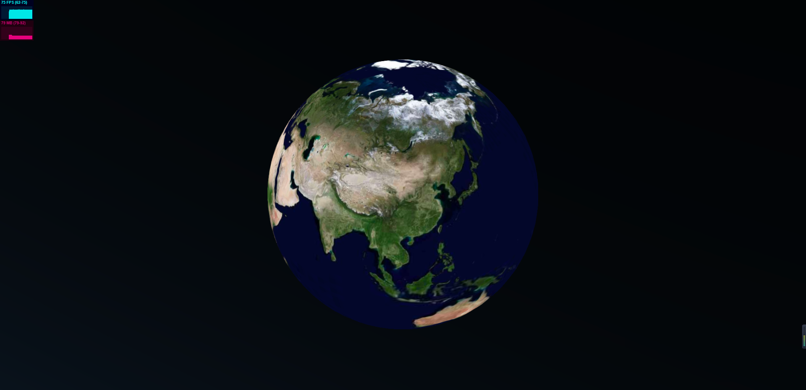

# Ori_map

## 注意：本项目还在试验阶段，请斟酌使用。

#### 🔥介绍



基于Orillusion(WebGPU)的GIS引擎demo

#### 🚀特性

1. Orillusion作为渲染引擎， [ECS](https://wikipedia.org/wiki/Entity_component_system) 结构，遵循 `组合优于继承` 的开发设计原则，实现了自己的组件系统。
2. 参考cesium，具备实用性，GIS图形的精确性。
3. 自定义性更强,mesh使用geometry,material;可以使用ComputeShader

#### 🌎路线
1. - [x] 3d globe
2. - [x] 相机控制,与cesium相同
3. - [ ] 支持3dtiles加载,已有初步成果
4. - [x] 栅格瓦片图层，支持EPSG:4326
5. - [ ] 矢量瓦片图层
7. - [ ] 地形

#### 📖文档

目前还没有文档,大部分api都与cesium相同

#### **💻开发**

```js
//运行程序
cd Ori_map
yarn     // or npm i
yarn dev // or npm run dev
```

